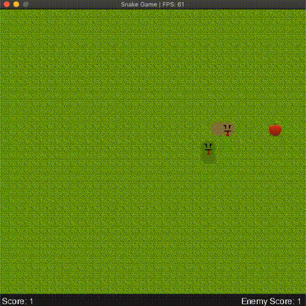

# CPPND Capstone: Snake Game

This is the Capstone project in the [Udacity C++ Nanodegree Program](https://www.udacity.com/course/c-plus-plus-nanodegree--nd213). The project chosen is Capstone Option 2.

The game is like the classic snake game except there is an ememy snake competing for food. The enemy is a simple AI which seeks and moves towards food. 

Snakes grow every time they eat a fruit  and they earn 1 point for it. There is an addtional point for eating a bonus frog  and the growth is also double that of eating a fruit. The bonus frog appears at random intervals and disappears soon. 

The snake keep growing until it dies biting itself. 



## Dependencies for Running Locally
* cmake >= 3.7
  * All OSes: [click here for installation instructions](https://cmake.org/install/)
* make >= 4.1 (Linux, Mac), 3.81 (Windows)
  * Linux: make is installed by default on most Linux distros
  * Mac: [install Xcode command line tools to get make](https://developer.apple.com/xcode/features/)
  * Windows: [Click here for installation instructions](http://gnuwin32.sourceforge.net/packages/make.htm)
* gcc/g++ >= 5.4
  * Linux: gcc / g++ is installed by default on most Linux distros
  * Mac: same deal as make - [install Xcode command line tools](https://developer.apple.com/xcode/features/)
  * Windows: recommend using [MinGW](http://www.mingw.org/)
* SDL2 >= 2.0
  * Linux:
  Install using `apt-get` is preferred to building from source. 
  ```
    sudo apt-get update
    sudo apt-get -y install libsdl2-dev
    sudo apt-get -y install libsdl2-ttf-dev
    sudo apt-get -y install libsdl2-image-dev
  ```
  * Mac:
  Install using `homebrew` is preferred. 
  ```
    brew install sdl2
    brew install sdl2_ttf
    brew install sdl2_image
  ```
  * For other platforms, the instructions can be found [here](https://wiki.libsdl.org/Installation)

## Basic Build Instructions

1. Clone this repo.
2. Make a build directory in the top level directory: `mkdir build && cd build`
3. Compile: `cmake .. && make`
4. Run it: `./SnakeGame`.


## Code Structure


The main classes of the program as are `Game`, `Snake`, `Controller` and `Renderer`. 

**Game** is composed of objects of `Snake`, `Controller` and `Renderer`. This class run the main Game Loop where all the action takes palce.

**Snake** class describes the our hero, the snake. It contains information and beavior of the snake.

**Controller** handles the input and makes the snake move. 

**Renderer** renders the game by creating SDL window, loading assets and drawing all the UI elements. 

Other than this there are classes which help in rendering such as `Tilemap` and `Text`. 

## Rubric Points Addressed

### README
|Critera| Explaination|
|--------|-------------|
|A README with instructions is included with the project|[README](https://github.com/bharatkrishna/CppND-Capstone-Snake-Game/blob/master/README.md)|
|The README indicates which project is chosen.| See project description in this README|
|The README includes information about each rubric point addressed.| Addressed in this section|

### Compiling and Testing
Project compiles when instructions from **Basic Build Instructions** section is followed. 

### Loops, Functions, I/O
|Criteria| Explaination|
|--------|-------------|
|The project demonstrates an understanding of C++ functions and control structures.| Code is organized into functions. Refer to `game.cpp` for example.|
|The project reads data from a file and process the data, or the program writes data to a file.| Files are read in `tilemap.cpp`|
|The project accepts user input and processes the input.| User input handled in `handler.cpp`|

### Object Oriented Programming
|Criteria| Explaination|
|--------|-------------|
|The project uses Object Oriented Programming techniques.| Code is organized into classes as described in **Code Structure** section. The `Game` class followes OOP techniques of composition. |
|Classes use appropriate access specifiers for class members.| Appropriate access specifiers in all classes to keep some members private and some public.|
|Class constructors utilize member initialization lists.| Initialization lists are used in `Snake` class (`snake.cpp`) and `Text` class (`text.cpp`) constructors. |

### Memory Management
|Criteria| Explaination|
|--------|-------------|
|The project makes use of references in function declarations.| Several methods use pass-by-reference throughout the application |
|The project uses destructors appropriately.| Destructors are used to destroy the window an quit SDL in `Rederer` class (`renderer.cpp`) |
|The project uses smart pointers instead of raw pointers.| `unique_ptr` is used in `Renderer` class constructor to point to an object of the `Text` class created on the heap memory`|


## Acknowledgements 
* Code for rendering images is based on https://github.com/spajus/sdl2-snake
* Code for rendering text is based on https://www.youtube.com/watch?v=FIjj6UVXtXk
